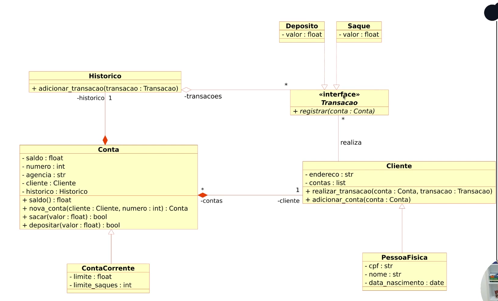

# Desafio Sistema Bancário
## Descrição 
iniciar a modelagem do sistema bancário em POO, adicionar a classe para cliente e para operações bancárias: Depósito e Saque
Atualizar a implementação do sistema bancario, para armazenar os dados de clientes e contas bancárias 
em objetos ao invés de dicionários. Seguindo a seguinte UML

# UML
